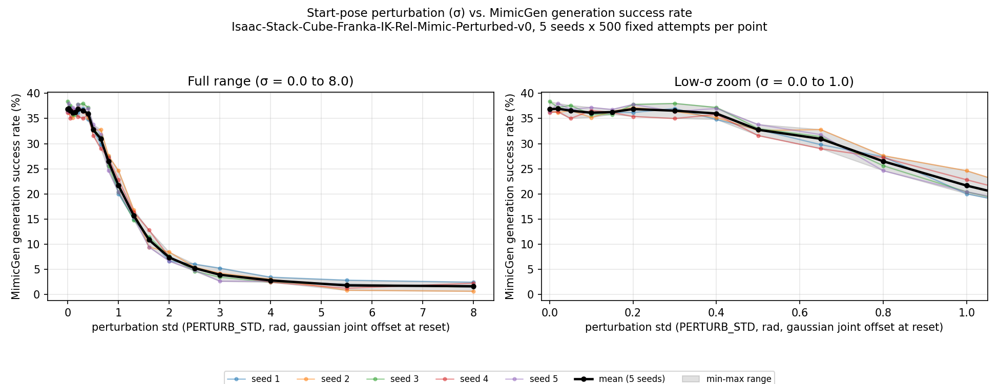

# 接触锚定扰动增广：最小验证路径实验记录 v1

> 对应设计文档：`docs/接触锚定扰动增广_设计记录.md` 第6节"最小验证路径"。
> 本文件只记录**测到的数字和执行过程中的事实**，不下"方法是否有效/是否达到预期"这类结论——
> 那需要放进具体应用场景（比如后续拿这条曲线去指导 DP 训练数据的偏差范围）之后才能判断，
> 属于下一步。

## 1. 实验设置

- 环境：`Isaac-Stack-Cube-Franka-IK-Rel-Mimic-Perturbed-v0`（新增的可调 σ 变体，继承官方
  `Isaac-Stack-Cube-Franka-IK-Rel-Mimic-v0`，源码见
  `source/isaaclab_mimic/isaaclab_mimic/envs/franka_stack_ik_rel_perturbed_mimic_env_cfg.py`）。
- 扰动机制：复用已有的 reset 事件 `randomize_franka_joint_state`
  （`franka_stack_events.randomize_joint_by_gaussian_offset`，对机器人全部关节含夹爪加高斯噪声），
  把其 `std` 参数从环境变量 `PERTURB_STD` 读取，使其可扫描。这个噪声在 `env.reset()` 时生效，
  正好构成 MimicGen 生成时第一个 subtask 插值起点的扰动（起点=扰动，接触段=完全不碰，冻结不变）。
- 数据源：官方 10 条源演示的标注版 `datasets/annotated_dataset.hdf5`，未重新采集/标注。
- 判据：沿用环境自带的 `success_term`（真任务成功——两块方块正确堆叠），不是"没撞到"。
- σ 网格（20 个值）：0.00, 0.02, 0.05, 0.10, 0.15, 0.20, 0.30, 0.40, 0.50, 0.65, 0.80, 1.00,
  1.30, 1.60, 2.00, 2.50, 3.00, 4.00, 5.50, 8.00（弧度，逐关节高斯噪声幅度）。
- 每个 (σ, seed) 点固定跑 **500 次生成尝试**（不是"凑够500个成功"——用
  `PERTURB_FIXED_ATTEMPTS` 环境变量把 `datagen_config.generation_guarantee` 切成 `False`，
  原因见下文"执行中的异常"）。
- 独立 seed 数：**5**（1~5），整套 σ 网格各跑一遍，用于复现性检查。
- 规模：20 σ × 5 seed × 500 尝试 = **10 万次生成尝试**，`num_envs=10`。

## 2. 数据完整性核实

- 每个 (σ, seed) 点跑完立即 fsync 落盘一行 CSV，脚本自带断点续跑（已用小规模冒烟测试验证过）。
- 全部 100 个点（20σ×5seed）跑完后，脚本自带的核验通过：每个点的
  `n_success + n_failed == 500`（不是只信进程退出码，是重新打开 hdf5 文件数出来的）。
- **我又独立复核了一遍，不只是信脚本自己的说法**：
  - `combined.csv` 恰好 100 行，(seed, σ) 组合无重复、无缺失。
  - 随机抽了 8 个点，直接重新打开对应的 hdf5 文件用 h5py 数 demo 数，
    跟 CSV 记录逐一核对，**8/8 完全一致**。
- 原始 hdf5（每个点约 20~85MB，100 个点合计几个 GB）留在
  `datasets/perturbation_sweep_v1/seed{1..5}/`（该目录被 `.gitignore` 忽略，不进 git）；
  结果表（`combined.csv`/`aggregate.csv`）、图（`success_rate_vs_sigma.png`）随本文件一起提交。

## 3. 结果

### 3.1 汇总表（跨5个seed）

| σ (rad) | 均值成功率 | 跨seed标准差 | 跨seed最小 | 跨seed最大 | 合并成功率(n=2500) | 95% CI |
|---|---|---|---|---|---|---|
| 0.00 | 36.8% | 0.8pp | 36.2% | 38.4% | 36.8% | [34.9%, 38.7%] |
| 0.02 | 37.0% | 0.6pp | 36.2% | 38.0% | 37.0% | [35.1%, 38.9%] |
| 0.05 | 36.6% | 0.9pp | 35.0% | 37.6% | 36.6% | [34.7%, 38.5%] |
| 0.10 | 36.2% | 0.7pp | 35.2% | 37.2% | 36.2% | [34.3%, 38.0%] |
| 0.15 | 36.3% | 0.3pp | 35.8% | 36.8% | 36.3% | [34.4%, 38.2%] |
| 0.20 | 36.9% | 0.9pp | 35.4% | 37.8% | 36.9% | [35.0%, 38.8%] |
| 0.30 | 36.6% | 1.0pp | 35.0% | 38.0% | 36.6% | [34.7%, 38.5%] |
| 0.40 | 36.0% | 0.9pp | 34.8% | 37.2% | 36.0% | [34.1%, 37.9%] |
| 0.50 | 32.8% | 0.7pp | 31.6% | 33.8% | 32.8% | [30.9%, 34.6%] |
| 0.65 | 31.0% | 1.4pp | 29.0% | 32.8% | 31.0% | [29.1%, 32.8%] |
| 0.80 | 26.5% | 1.2pp | 24.6% | 27.6% | 26.5% | [24.8%, 28.2%] |
| 1.00 | 21.6% | 1.8pp | 20.0% | 24.6% | 21.6% | [20.0%, 23.2%] |
| 1.30 | 15.7% | 0.8pp | 14.8% | 16.8% | 15.7% | [14.2%, 17.1%] |
| 1.60 | 10.8% | 1.3pp | 9.4% | 12.8% | 10.8% | [9.6%, 12.1%] |
| 2.00 | 7.3% | 0.7pp | 6.6% | 8.4% | 7.3% | [6.3%, 8.3%] |
| 2.50 | 5.2% | 0.5pp | 4.6% | 6.0% | 5.2% | [4.3%, 6.1%] |
| 3.00 | 3.9% | 0.9pp | 2.6% | 5.2% | 3.9% | [3.1%, 4.6%] |
| 4.00 | 2.8% | 0.4pp | 2.4% | 3.4% | 2.8% | [2.1%, 3.4%] |
| 5.50 | 1.8% | 0.7pp | 0.8% | 2.8% | 1.8% | [1.2%, 2.3%] |
| 8.00 | 1.6% | 0.6pp | 0.6% | 2.4% | 1.6% | [1.1%, 2.1%] |

（`docs/perturbation_sweep_v1_results/aggregate.csv` 是同一份数据的机器可读版；
`combined.csv` 是未聚合的 100 行原始记录；`seed{1..5}.csv` 是逐 seed 的记录。）

### 3.2 曲线图

左：全范围（σ=0~8）。右：低σ放大（σ=0~1）。细彩线=各 seed，黑粗线=5-seed 均值，
灰色带=跨 seed 最小-最大范围。

### 3.3 关于"基线对照"的说明

⚠️ 写这份记录时特意核对过：**不要拿更早 pipeline 验证阶段那个 20/41≈48.8% 的数字
当基线来对比**——那是 n=41 的小样本，95%置信区间宽达 [33.5%, 64.1%]，
跟这次 n=500 测出的 [32.8%, 41.2%]（σ=0.02点）是重叠的，只是当初样本太小、随机偏高，
不是真实差异。**本记录内部的 σ=0.00 / σ=0.02 两个点（均为 n=500）才是这次实验自己的基线**，
对比其它 σ 的变化应该以这两个点为参照。

## 4. 观察到的形状（只是描述曲线，不是结论）

- σ 从 0.00 到约 0.40，成功率基本持平在 36~37%（跨这几个点的差异都在跨-seed标准差量级内，
  即 <1个百分点），没有观察到随σ单调下降的迹象。
- σ 从约 0.5 到 1.6，成功率快速下降（32.8%→10.8%），是曲线下降最快的区间。
- σ 从约 2.0 往上，成功率继续下降但斜率明显变缓，到 σ=5.5/8.0 时趋于 1.6~1.8%，
  两点数值接近，且跨-seed标准差(0.6~0.7pp)显示这个低位是稳定的，不是还在继续往下掉的中途。

## 5. 执行过程中的异常（如实记录，供以后同类实验参考）

**① 首次尝试用 Claude Code 的 `run_in_background` 机制发起整个约5.85小时的单次后台任务，
运行约61分钟后被系统标记为 `killed`**（不是脚本报错、不是OOM、不是崩溃——`dmesg`/内存/磁盘
都查过没有异常）。查证：Anthropic 官方文档未记载后台任务有固定时长上限；另外验证了一个更短的
纯等待循环也被同样机制杀掉、且存活时间远短于61分钟，说明不是简单的"约1小时定时器"，
根因未完全查清。**旁证**：同一时间用 Monitor 工具挂的持久日志监听没有被杀，
说明影响面看起来只限于 Claude Code 自己 track 的 `run_in_background` 类型任务。

**② 上述 wrapper 进程被杀时，它已经 spawn 出去的子进程（真正跑 Isaac Sim 生成的那个）
没有被一起收掉，变成孤儿进程继续运行**——但后来发现这个孤儿进程本身也卡死了：
跑到 441/500 次尝试后，输出文件超过1小时不再增长，同时进程仍占用 100%+ CPU（不是挂起）。
杀掉后确认数据不完整（441≠500），按脚本自带的断点续跑逻辑丢弃重跑。

**根因推测（有实证支持但非100%确认）**：wrapper 用
`subprocess.run(cmd, capture_output=True)` 起子进程，读端(PIPE)在 wrapper 手里；
wrapper 被强杀后这两根管道的读端消失，子进程写 stdout/stderr 时可能触发 SIGPIPE/EPIPE，
如果 Isaac Sim 内部日志子系统没处理好这种情况，就可能表现成"吃CPU但零进展"。
已做防御性修复（把子进程输出直接重定向到日志文件，不再经过 Python 管的 PIPE），
`commit cac8766d9`。

**处理方式**：改用 `setsid nohup ... </dev/null & disown` 重新发起（让新 wrapper 进程
成为独立 session leader，`ps` 核实过 `SID==PID`，不再挂在原 session 下），
配合脚本自带的按点断点续跑（跳过已完成的16个点，从σ=3.0续跑）。
监控方式也从"信任 Claude Code 对后台任务的存活通知"改成"持久 Monitor 盯日志文件内容 +
每2分钟 `pgrep` 心跳检查双重覆盖"。

**结果**：重新发起后，σ=3.0 及之后所有点（含4个 seed=1 剩余点 + seed 2~5 全部20点，
合计84个点）全部一次性正常完成，**没有再复现卡死**。样本量还不足以严格证明
"孤儿化是卡死的唯一原因"，但目前的证据（问题只在 wrapper 被杀+管道读端消失的那一次出现，
修复+重新发起后 84/84 点零复发）是一致的。

## 6. 下一步（本记录范围之外，留给后续决策）

- 按设计文档第6节的分期，本轮只验证了"起点位姿扰动"这一个自由度，
  没有实现 σ(d(t)) 完整衰减包络、没有做扫描/生成模式拆分、没有做分层重采样修正、
  没有碰双臂/G2/VR——这些仍在"下一步再说"的范围。
- 这条曲线本身要不要、怎么用来指导后续（比如"生成模式"该把 σ 定在哪个值、
  或者是不是要在 σ 陡降的 0.5~1.6 区间加密重新测），是设计文档里"分清哪一半扎实/投机"
  那一节要处理的判断，留给用户和下一轮对话决定，这份记录只负责把测到的数字摆出来。
