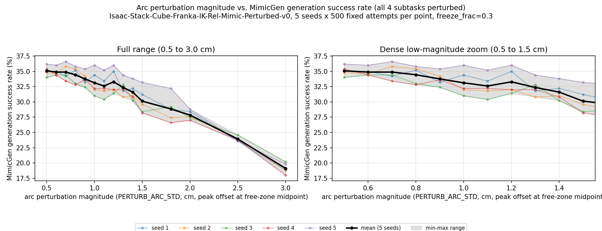

# 全subtask弧线轨迹扰动：v2 正式扫描实验记录

> 对应设计记录：`CLAUDE.md` "主线二·扩展到全部subtask轨迹多样化"节（v1→v2 完整推导过程）。
> 本文件跟 `docs/接触锚定扰动增广_实验记录_v1.md`（起点位姿扰动实验）是**两条独立实验**，
> 机制不同、不能直接对比数值。跟 v1 一样：本文件只记录**测到的数字和执行过程的事实**，
> 不下"方法是否有效/是否达到预期"这类结论——那需要等第二层（LeRobot训练+仿真测评）
> 跑完才能判断，见 CLAUDE.md"主线二的成功判据"节。

## 1. 实验设置

- 机制：`_apply_arc_perturbation`（`source/isaaclab_mimic/isaaclab_mimic/datagen/data_generator.py`），
  对**全部4个subtask**的目标轨迹（`transformed_eef_poses`）逐帧施加 `sin²(πu)` 包络位移，
  两端数值和斜率都收敛到0（无速度台阶），只扰动平移分量、不碰姿态；不碰实时物理状态，
  被扰动的是MimicGen生成的目标轨迹本身，机器人靠正常的插值+物理步进控制环执行，
  手中物体跟随真实运动（不会被瞬移甩脱）。
- 环境变量：`PERTURB_ARC_STD`（幅度，米，本次扫描的自变量）、
  `PERTURB_ARC_FREEZE_FRAC=0.3`（固定，尾部30%冻结不扰动）、
  `PERTURB_STD=0`（固定，隔离掉 v1 实验用的 reset 关节噪声机制，只测弧线效应）、
  `PERTURB_FIXED_ATTEMPTS=1`（固定尝试数模式，见下）。
- 任务/数据源：跟 v1 相同，`Isaac-Stack-Cube-Franka-IK-Rel-Mimic-Perturbed-v0` +
  `datasets/annotated_dataset.hdf5`（官方10条标注源演示），未重新采集。
- 判据：环境自带 `success_term`（真任务成功）。
- 幅度网格（15个值，单位cm，脚本内部换算成米填 `PERTURB_ARC_STD`）：
  密集段（步长0.1cm）0.5~1.5；稀疏延伸段 1.8, 2.0, 2.5, 3.0。
- 每个 (幅度, seed) 点固定跑 **500次生成尝试**（`PERTURB_FIXED_ATTEMPTS=1`，
  `generation_guarantee` 切 `False`，语义从"凑够N个成功"变成"固定跑N次"——沿用
  v1实验查出的教训：`max_num_failures` 是死配置，不加这层会在低成功率区间无界重试）。
- 独立seed数：**5**（1~5），整套幅度网格各跑一遍。
- 规模：15幅度 × 5seed × 500次尝试 = **37500次生成尝试**，`num_envs=10`。
- 脚本：`scripts/imitation_learning/isaaclab_mimic/sweep_arc_perturbation.py`
  （跟 v1 用的 `sweep_start_pose_perturbation.py` 是独立脚本，v1的脚本未改动）。

## 2. 数据完整性核实

- 每个点跑完立即 fsync 落盘一行CSV，脚本自带断点续跑（正式跑之前先用2点×1seed×20次
  尝试做过冒烟测试，包括验证重跑会正确跳过已完成的点）。
- 全部75个点（15幅度×5seed）跑完后，脚本自带核验全部通过：
  `n_success + n_failed == 500`（重新打开hdf5数demo数，不只信进程退出码）。
- **独立复核**（不只信脚本自己的说法）：
  - `combined.csv` 恰好75行，(seed, 幅度) 组合无重复无缺失。
  - 随机抽了8个点直接重新打开hdf5核对demo数，**8/8完全一致**。
- 原始hdf5留在 `datasets/perturbation_sweep_v2_arc/seed{1..5}/`（`.gitignore` 忽略，不进git）；
  结果表和图随本文件一起提交到 `docs/perturbation_sweep_v2_arc_results/`。

## 3. 执行过程

**全程无异常**——跟 v1 实验不同（v1 遇到过后台任务被杀、孤儿进程SIGPIPE卡死两次事故），
这次直接复用 v1 修复过的所有安全模式（`setsid nohup ... </dev/null & disown` 发起、
子进程输出直接写文件不用PIPE、持久Monitor盯日志+定期`pgrep`心跳），
5个seed全部一次性正常跑完，零重跑、零卡死。

**耗时**：实测约235~238秒/点（比 v1 实验的约210秒/点略高，弧线扰动每帧都要算包络
和采样方向向量，比v1单纯改reset噪声多一点计算量），全程稳定，没有随seed推进而上涨的趋势
（4个seed的平均耗时分别是238.4/234.7/235.2/237.1秒/点）。总耗时约4.9小时，
在用户给的6小时预算内，留了约1小时缓冲。

## 4. 结果

### 4.1 汇总表（跨5个seed）

| 幅度(cm) | 均值成功率 | 跨seed标准差 | 跨seed最小 | 跨seed最大 | 合并成功率(n=2500) | 95% CI |
|---|---|---|---|---|---|---|
| 0.5 | 35.1% | 0.7pp | 34.0% | 36.2% | 35.1% | [33.2%, 37.0%] |
| 0.6 | 34.9% | 0.6pp | 34.4% | 36.0% | 34.9% | [33.0%, 36.8%] |
| 0.7 | 34.9% | 1.2pp | 33.4% | 36.6% | 34.9% | [33.0%, 36.8%] |
| 0.8 | 34.4% | 1.3pp | 32.8% | 35.8% | 34.4% | [32.6%, 36.3%] |
| 0.9 | 33.8% | 1.0pp | 32.4% | 35.4% | 33.8% | [31.9%, 35.6%] |
| 1.0 | 33.1% | 1.8pp | 31.0% | 36.0% | 33.1% | [31.3%, 35.0%] |
| 1.1 | 32.6% | 1.6pp | 30.4% | 35.2% | 32.6% | [30.8%, 34.4%] |
| 1.2 | 33.3% | 1.8pp | 31.4% | 36.0% | 33.3% | [31.4%, 35.1%] |
| 1.3 | 32.4% | 1.2pp | 30.8% | 34.4% | 32.4% | [30.5%, 34.2%] |
| 1.4 | 31.6% | 1.3pp | 30.2% | 33.8% | 31.6% | [29.8%, 33.4%] |
| 1.5 | 30.1% | 1.9pp | 28.2% | 33.2% | 30.1% | [28.3%, 31.9%] |
| 1.8 | 28.8% | 1.9pp | 26.6% | 32.2% | 28.8% | [27.1%, 30.6%] |
| 2.0 | 27.8% | 0.7pp | 27.0% | 28.8% | 27.8% | [26.1%, 29.6%] |
| 2.5 | 23.9% | 0.4pp | 23.6% | 24.6% | 23.9% | [22.2%, 25.6%] |
| 3.0 | 19.1% | 0.8pp | 18.0% | 20.2% | 19.1% | [17.6%, 20.7%] |

（`docs/perturbation_sweep_v2_arc_results/aggregate.csv` 是机器可读版；
`combined.csv` 是75行未聚合原始记录；`seed{1..5}.csv` 是逐seed记录。）

### 4.2 曲线图

左：全范围（0.5~3.0cm）。右：密集低幅度段放大（0.5~1.5cm）。细彩线=各seed，
黑粗线=5-seed均值，灰色带=跨seed最小-最大范围。

### 4.3 观察到的形状（只是描述曲线，不是结论）

- 0.5~0.9cm：成功率从35.1%缓慢降到33.8%，跨这几个点的下降幅度（约1.3个百分点）
  接近跨seed标准差量级，不算陡峭。
- 0.9~1.5cm：继续下降，33.8%→30.1%，斜率比前一段略大但仍然平缓，
  且1.0~1.2cm这三个点顺序有小幅波动（33.1%/32.6%/33.3%），差异在跨seed标准差
  （1.6~1.8pp）以内，看起来是噪声不是真实的局部回升。
- 1.5cm往后到3.0cm（含稀疏延伸段）：下降变得更明显，30.1%→19.1%，
  是整条曲线里降幅最大的区间，且没有像v1实验那样在高幅度端趋于平缓——
  3.0cm仍在下降，没有观察到"塌陷后稳定"的迹象，说明这个网格的稀疏延伸段
  可能还没覆盖到那个平台。

### 4.4 一个派生数字（数学推算，不是新的实测量）

假设4个subtask的成功与否近似独立（这是一个建模假设，**没有单独验证过**，
只是拿合并成功率反推"单个subtask平均成功率"的一个参考量）：
单subtask隐含成功率 = 合并成功率^(1/4)。算出来的范围是
0.5cm处约77.0%，一路降到3.0cm处约66.1%——中间幅度（1.0~1.5cm）落在约74~76%这个区间。
这个数字只是换算，不代表真的测过"单个subtask单独扰动"这个量。

## 5. 下一步（本记录范围之外，留给后续决策）

- 这轮只覆盖了0.5~3.0cm，且3.0cm处曲线仍在下降、没有摸到"塌陷后稳定"的平台——
  如果要一次DAgger/训练要用的正式生成，还是要先在应用决策阶段确认要用哪个幅度点，
  可能还需要在低于0.5cm或高于3.0cm的方向补点。
- 第4.4节的"单subtask隐含成功率"是否值得单独测一次（比如只扰1个subtask、其它3个
  freeze_frac=1.0关掉），可以验证"4个subtask独立"这个假设站不站得住——这次没做。
- `freeze_frac=0.3` 这个参数这次是固定值，没有扫描过它自身对成功率的影响。
- 跟v1实验（起点位姿扰动）一样，第一层（生成成功率）只是前置门槛，
  真正验证"这批增广数据训出来的策略是否更好"要等第二层（LeRobot训DP/ACT+仿真测评），
  目前完全没开始。
